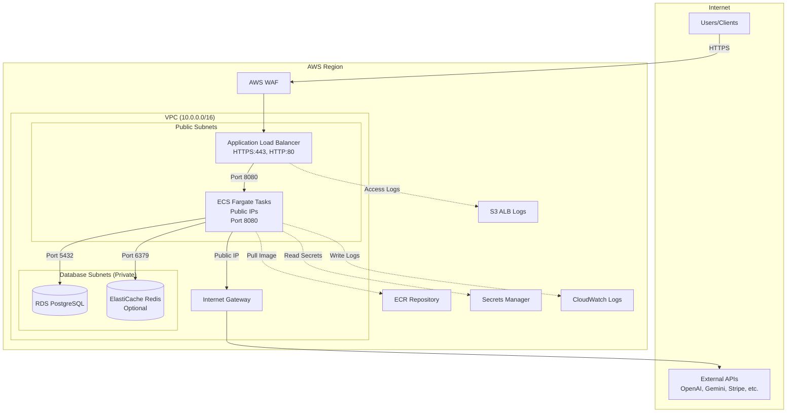

# Design Document: AWS Terraform Infrastructure

## Overview

This design describes the Terraform infrastructure for deploying a Rust Axum API to AWS. The architecture prioritizes cost efficiency by eliminating NAT Gateways while maintaining security through layered security groups and AWS WAF. ECS Fargate tasks run in public subnets with public IP addresses, enabling direct internet access for external API calls (OpenAI, Gemini, Stripe, Brave Search, Supabase).

The infrastructure is organized as a modular Terraform project with environment-specific configurations managed through tfvars files.

## Project Separation

**Important:** This Terraform infrastructure code should live in a **separate repository/project** from the Rust application code. This separation provides:
- Independent versioning of infrastructure and application
- Different access controls (infra team vs app developers)
- Cleaner CI/CD pipelines
- Ability to manage infrastructure across multiple applications

The Terraform project references the Rust application only via the ECR repository URL - there are no direct file dependencies between the two projects.

## Architecture



## Components and Interfaces

### Directory Structure

This Terraform project should be created as a **separate repository** (e.g., `your-project-infra` or `your-project-terraform`).

```
<separate-terraform-repo>/
├── main.tf                 # Root module, provider config
├── variables.tf            # Input variables
├── outputs.tf              # Output values
├── versions.tf             # Terraform and provider versions
├── backend.tf              # S3 backend configuration
├── locals.tf               # Local values and naming conventions
├── environments/
│   ├── dev.tfvars
│   ├── staging.tfvars
│   └── prod.tfvars
├── modules/
│   ├── vpc/
│   │   ├── main.tf
│   │   ├── variables.tf
│   │   └── outputs.tf
│   ├── ecr/
│   │   ├── main.tf
│   │   ├── variables.tf
│   │   └── outputs.tf
│   ├── ecs/
│   │   ├── main.tf
│   │   ├── variables.tf
│   │   └── outputs.tf
│   ├── alb/
│   │   ├── main.tf
│   │   ├── variables.tf
│   │   └── outputs.tf
│   ├── rds/
│   │   ├── main.tf
│   │   ├── variables.tf
│   │   └── outputs.tf
│   ├── elasticache/
│   │   ├── main.tf
│   │   ├── variables.tf
│   │   └── outputs.tf
│   ├── security-groups/
│   │   ├── main.tf
│   │   ├── variables.tf
│   │   └── outputs.tf
│   ├── secrets/
│   │   ├── main.tf
│   │   ├── variables.tf
│   │   └── outputs.tf
│   ├── waf/
│   │   ├── main.tf
│   │   ├── variables.tf
│   │   └── outputs.tf
│   └── monitoring/
│       ├── main.tf
│       ├── variables.tf
│       └── outputs.tf
└── scripts/
    └── bootstrap-state.sh  # Creates S3 bucket and DynamoDB table
```

### Module Interfaces

#### VPC Module

```hcl
# Inputs
variable "project_name" { type = string }
variable "environment" { type = string }
variable "vpc_cidr" { type = string, default = "10.0.0.0/16" }
variable "availability_zones" { type = list(string) }

# Outputs
output "vpc_id" { value = aws_vpc.main.id }
output "public_subnet_ids" { value = aws_subnet.public[*].id }
output "database_subnet_ids" { value = aws_subnet.database[*].id }
output "internet_gateway_id" { value = aws_internet_gateway.main.id }
```

#### ECR Module

```hcl
# Inputs
variable "project_name" { type = string }
variable "environment" { type = string }
variable "image_retention_count" { type = number, default = 30 }

# Outputs
output "repository_url" { value = aws_ecr_repository.main.repository_url }
output "repository_arn" { value = aws_ecr_repository.main.arn }
```

#### Security Groups Module

```hcl
# Inputs
variable "project_name" { type = string }
variable "environment" { type = string }
variable "vpc_id" { type = string }
variable "enable_redis" { type = bool, default = false }

# Outputs
output "alb_security_group_id" { value = aws_security_group.alb.id }
output "ecs_security_group_id" { value = aws_security_group.ecs.id }
output "rds_security_group_id" { value = aws_security_group.rds.id }
output "redis_security_group_id" { value = var.enable_redis ? aws_security_group.redis[0].id : null }
```

#### ALB Module

```hcl
# Inputs
variable "project_name" { type = string }
variable "environment" { type = string }
variable "vpc_id" { type = string }
variable "public_subnet_ids" { type = list(string) }
variable "security_group_id" { type = string }
variable "certificate_arn" { type = string }
variable "access_logs_bucket" { type = string }
variable "health_check_path" { type = string, default = "/health" }

# Outputs
output "alb_arn" { value = aws_lb.main.arn }
output "alb_dns_name" { value = aws_lb.main.dns_name }
output "target_group_arn" { value = aws_lb_target_group.main.arn }
output "https_listener_arn" { value = aws_lb_listener.https.arn }
```

#### ECS Module

```hcl
# Inputs
variable "project_name" { type = string }
variable "environment" { type = string }
variable "vpc_id" { type = string }
variable "public_subnet_ids" { type = list(string) }
variable "security_group_id" { type = string }
variable "target_group_arn" { type = string }
variable "ecr_repository_url" { type = string }
variable "image_tag" { type = string, default = "latest" }
variable "cpu" { type = number }
variable "memory" { type = number }
variable "desired_count" { type = number, default = 2 }
variable "secrets_arns" { type = map(string) }
variable "log_group_name" { type = string }
variable "health_check_path" { type = string, default = "/health" }

# Outputs
output "cluster_arn" { value = aws_ecs_cluster.main.arn }
output "service_name" { value = aws_ecs_service.main.name }
output "task_definition_arn" { value = aws_ecs_task_definition.main.arn }
```

#### RDS Module

```hcl
# Inputs
variable "project_name" { type = string }
variable "environment" { type = string }
variable "database_subnet_ids" { type = list(string) }
variable "security_group_id" { type = string }
variable "instance_class" { type = string }
variable "allocated_storage" { type = number, default = 20 }
variable "multi_az" { type = bool, default = false }
variable "backup_retention_period" { type = number, default = 7 }
variable "deletion_protection" { type = bool, default = false }
variable "database_name" { type = string }

# Outputs
output "endpoint" { value = aws_db_instance.main.endpoint }
output "database_name" { value = aws_db_instance.main.db_name }
output "master_username" { value = aws_db_instance.main.username }
output "master_password_secret_arn" { value = aws_secretsmanager_secret.db_password.arn }
```

#### ElastiCache Module

```hcl
# Inputs
variable "project_name" { type = string }
variable "environment" { type = string }
variable "database_subnet_ids" { type = list(string) }
variable "security_group_id" { type = string }
variable "node_type" { type = string }
variable "num_cache_nodes" { type = number, default = 1 }

# Outputs
output "endpoint" { value = aws_elasticache_cluster.main.cache_nodes[0].address }
output "port" { value = aws_elasticache_cluster.main.cache_nodes[0].port }
```

#### Secrets Module

```hcl
# Inputs
variable "project_name" { type = string }
variable "environment" { type = string }
variable "database_url" { type = string }
variable "redis_url" { type = string, default = "" }
variable "supabase_url" { type = string }
variable "supabase_anon_key" { type = string }
variable "supabase_service_role_key" { type = string }
variable "openai_api_key" { type = string }
variable "gemini_api_key" { type = string }
variable "stripe_secret_key" { type = string }
variable "stripe_webhook_secret" { type = string }
variable "brave_search_api_key" { type = string }

# Outputs
output "secret_arns" { 
  value = {
    database_url              = aws_secretsmanager_secret.database_url.arn
    redis_url                 = var.redis_url != "" ? aws_secretsmanager_secret.redis_url[0].arn : null
    supabase_url              = aws_secretsmanager_secret.supabase_url.arn
    supabase_anon_key         = aws_secretsmanager_secret.supabase_anon_key.arn
    supabase_service_role_key = aws_secretsmanager_secret.supabase_service_role_key.arn
    openai_api_key            = aws_secretsmanager_secret.openai_api_key.arn
    gemini_api_key            = aws_secretsmanager_secret.gemini_api_key.arn
    stripe_secret_key         = aws_secretsmanager_secret.stripe_secret_key.arn
    stripe_webhook_secret     = aws_secretsmanager_secret.stripe_webhook_secret.arn
    brave_search_api_key      = aws_secretsmanager_secret.brave_search_api_key.arn
  }
}
```

#### WAF Module

```hcl
# Inputs
variable "project_name" { type = string }
variable "environment" { type = string }
variable "alb_arn" { type = string }
variable "rate_limit" { type = number, default = 2000 }

# Outputs
output "web_acl_arn" { value = aws_wafv2_web_acl.main.arn }
```

#### Monitoring Module

```hcl
# Inputs
variable "project_name" { type = string }
variable "environment" { type = string }
variable "ecs_cluster_name" { type = string }
variable "ecs_service_name" { type = string }
variable "alb_arn_suffix" { type = string }
variable "log_retention_days" { type = number, default = 30 }

# Outputs
output "log_group_name" { value = aws_cloudwatch_log_group.ecs.name }
output "alb_logs_bucket" { value = aws_s3_bucket.alb_logs.id }
```

## Data Models

### Environment Configuration

```hcl
# environments/dev.tfvars
environment = "dev"
vpc_cidr    = "10.0.0.0/16"

# ECS Configuration
ecs_cpu           = 256
ecs_memory        = 512
ecs_desired_count = 1

# RDS Configuration
rds_instance_class      = "db.t3.micro"
rds_allocated_storage   = 20
rds_multi_az            = false
rds_deletion_protection = false

# ElastiCache Configuration
enable_redis    = false
redis_node_type = "cache.t3.micro"

# environments/prod.tfvars
environment = "prod"
vpc_cidr    = "10.0.0.0/16"

# ECS Configuration
ecs_cpu           = 1024
ecs_memory        = 2048
ecs_desired_count = 2

# RDS Configuration
rds_instance_class      = "db.t3.medium"
rds_allocated_storage   = 100
rds_multi_az            = true
rds_deletion_protection = true

# ElastiCache Configuration
enable_redis    = true
redis_node_type = "cache.t3.small"
```

### Resource Naming Convention

```hcl
# locals.tf
locals {
  name_prefix = "${var.project_name}-${var.environment}"
  
  common_tags = {
    Project     = var.project_name
    Environment = var.environment
    ManagedBy   = "terraform"
  }
}
```

### ECS Task Definition Structure

```json
{
  "family": "${project}-${environment}-api",
  "networkMode": "awsvpc",
  "requiresCompatibilities": ["FARGATE"],
  "cpu": "${cpu}",
  "memory": "${memory}",
  "executionRoleArn": "${execution_role_arn}",
  "taskRoleArn": "${task_role_arn}",
  "containerDefinitions": [
    {
      "name": "api",
      "image": "${ecr_repository_url}:${image_tag}",
      "portMappings": [
        {
          "containerPort": 8080,
          "protocol": "tcp"
        }
      ],
      "secrets": [
        { "name": "DATABASE_URL", "valueFrom": "${database_url_secret_arn}" },
        { "name": "REDIS_URL", "valueFrom": "${redis_url_secret_arn}" },
        { "name": "SUPABASE_URL", "valueFrom": "${supabase_url_secret_arn}" },
        { "name": "SUPABASE_ANON_KEY", "valueFrom": "${supabase_anon_key_secret_arn}" },
        { "name": "SUPABASE_SERVICE_ROLE_KEY", "valueFrom": "${supabase_service_role_key_secret_arn}" },
        { "name": "OPENAI_API_KEY", "valueFrom": "${openai_api_key_secret_arn}" },
        { "name": "GEMINI_API_KEY", "valueFrom": "${gemini_api_key_secret_arn}" },
        { "name": "STRIPE_SECRET_KEY", "valueFrom": "${stripe_secret_key_secret_arn}" },
        { "name": "STRIPE_WEBHOOK_SECRET", "valueFrom": "${stripe_webhook_secret_secret_arn}" },
        { "name": "BRAVE_SEARCH_API_KEY", "valueFrom": "${brave_search_api_key_secret_arn}" }
      ],
      "logConfiguration": {
        "logDriver": "awslogs",
        "options": {
          "awslogs-group": "${log_group_name}",
          "awslogs-region": "${region}",
          "awslogs-stream-prefix": "ecs"
        }
      },
      "healthCheck": {
        "command": ["CMD-SHELL", "curl -f http://localhost:8080/health || exit 1"],
        "interval": 30,
        "timeout": 5,
        "retries": 3,
        "startPeriod": 60
      }
    }
  ]
}
```

### Security Group Rules Matrix

| Source | Destination | Port | Protocol | Purpose |
|--------|-------------|------|----------|---------|
| 0.0.0.0/0 | ALB | 80 | TCP | HTTP redirect |
| 0.0.0.0/0 | ALB | 443 | TCP | HTTPS ingress |
| ALB SG | ECS SG | 8080 | TCP | Application traffic |
| ECS SG | RDS SG | 5432 | TCP | Database access |
| ECS SG | Redis SG | 6379 | TCP | Cache access |
| ECS SG | 0.0.0.0/0 | All | All | External API calls |


## Correctness Properties

*A property is a characteristic or behavior that should hold true across all valid executions of a system—essentially, a formal statement about what the system should do. Properties serve as the bridge between human-readable specifications and machine-verifiable correctness guarantees.*

Based on the prework analysis, the following properties can be validated through Terraform plan inspection and validation:

**Property 1: No NAT Gateway Creation**

*For any* valid Terraform configuration with any environment (dev, staging, prod), the terraform plan output SHALL NOT contain any `aws_nat_gateway` resources.

**Validates: Requirements 1.6**

---

**Property 2: Subnet Count Matches Availability Zone Count**

*For any* list of availability zones provided as input, the number of public subnets created SHALL equal the number of AZs, AND the number of database subnets created SHALL equal the number of AZs.

**Validates: Requirements 1.2, 1.3**

---

**Property 3: Environment-Based Resource Sizing**

*For any* environment value in {dev, staging, prod}, the following resource configurations SHALL match the expected sizing:
- ECS CPU/Memory: dev(256/512), staging(512/1024), prod(1024/2048)
- RDS instance class: dev(db.t3.micro), staging(db.t3.small), prod(db.t3.medium)
- Redis node type (when enabled): dev(cache.t3.micro), staging(cache.t3.micro), prod(cache.t3.small)

**Validates: Requirements 3.3, 5.3, 6.2, 12.3, 12.4**

---

**Property 4: Production Multi-AZ Enforcement**

*For any* configuration where environment equals "prod", the RDS instance SHALL have multi_az set to true.

**Validates: Requirements 5.2**

---

**Property 5: Redis Conditional Resource Creation**

*For any* configuration, IF enable_redis is true THEN ElastiCache resources SHALL exist in the plan, AND IF enable_redis is false THEN NO ElastiCache resources SHALL exist in the plan.

**Validates: Requirements 6.1**

---

**Property 6: Required Secrets Completeness**

*For any* valid configuration, Secrets Manager secrets SHALL be created for ALL of the following: DATABASE_URL, SUPABASE_URL, SUPABASE_ANON_KEY, SUPABASE_SERVICE_ROLE_KEY, OPENAI_API_KEY, GEMINI_API_KEY, STRIPE_SECRET_KEY, STRIPE_WEBHOOK_SECRET, BRAVE_SEARCH_API_KEY.

**Validates: Requirements 8.1, 8.4**

---

**Property 7: ECS Task Secret References**

*For any* ECS task definition created, the secrets block SHALL reference ALL required secret ARNs from Secrets Manager.

**Validates: Requirements 3.7**

---

**Property 8: Consistent Naming Convention**

*For any* resource created by the Terraform module, the resource name SHALL follow the pattern `{project_name}-{environment}-{resource_type}`.

**Validates: Requirements 12.5**

## Error Handling

### Terraform Validation Errors

| Error Scenario | Handling Strategy |
|----------------|-------------------|
| Invalid environment value | Variable validation block restricts to dev/staging/prod |
| Missing required variables | Variables without defaults are marked as required |
| Invalid CIDR block format | Variable validation with regex pattern |
| Missing SSL certificate ARN | Required variable with descriptive error message |
| Invalid AZ names | Data source lookup validates AZ existence |

### Runtime Error Scenarios

| Error Scenario | Handling Strategy |
|----------------|-------------------|
| ECS task fails to start | Health check with startPeriod allows initialization time |
| Database connection failure | ECS service will restart tasks; CloudWatch alarm triggers |
| Secret retrieval failure | ECS task execution role has explicit permissions |
| ALB health check failure | Target group deregisters unhealthy targets |

### State Management Errors

| Error Scenario | Handling Strategy |
|----------------|-------------------|
| State lock contention | DynamoDB provides automatic lock management |
| State file corruption | S3 versioning enables rollback |
| Lost state file | S3 bucket has deletion protection |

## Testing Strategy

### Terraform Validation Testing

1. **Syntax Validation**: `terraform validate` on all configurations
2. **Format Checking**: `terraform fmt -check` for consistent formatting
3. **Plan Verification**: `terraform plan` with each environment tfvars

### Property-Based Testing with Terratest

Use Terratest (Go-based testing framework) to validate correctness properties:

```go
// Example property test structure
func TestNoNatGateway(t *testing.T) {
    // Feature: aws-terraform-infra, Property 1: No NAT Gateway Creation
    terraformOptions := &terraform.Options{
        TerraformDir: "../terraform",
        VarFiles:     []string{"environments/dev.tfvars"},
    }
    
    planStruct := terraform.InitAndPlanAndShowWithStruct(t, terraformOptions)
    
    for _, resource := range planStruct.ResourcePlannedValuesMap {
        assert.NotEqual(t, "aws_nat_gateway", resource.Type,
            "NAT Gateway should not be created")
    }
}
```

### Unit Tests (Examples)

- Verify VPC CIDR block configuration
- Verify security group rule definitions
- Verify IAM policy document structure
- Verify ECS task definition JSON structure

### Integration Tests

- Deploy to isolated test environment
- Verify ECS tasks can reach external APIs
- Verify ALB health checks pass
- Verify database connectivity from ECS
- Destroy test environment after validation

### Test Configuration

- Property tests: Minimum 3 iterations (one per environment)
- Tag format: **Feature: aws-terraform-infra, Property {number}: {property_text}**
- Each correctness property implemented as a single Terratest function
