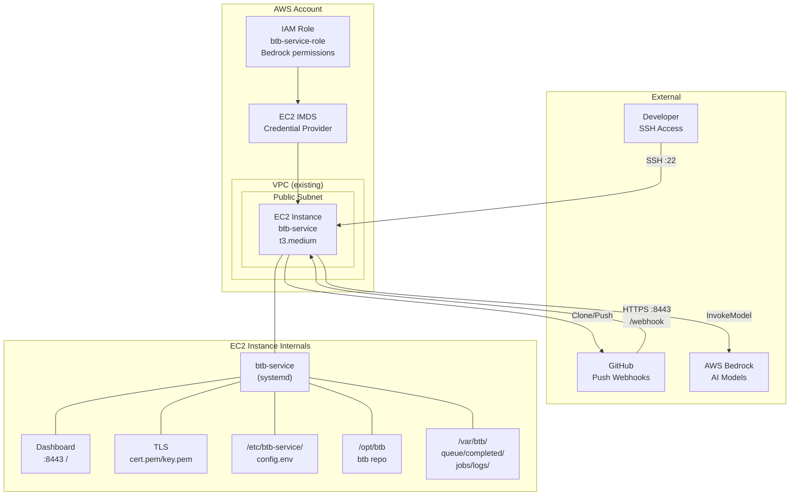

# Design Document: btb-ec2-setup

## Overview

This design describes the Terraform modules and configuration needed to deploy a btb-service on an EC2 instance within the existing AWS infrastructure project. The design adds three new Terraform modules (`btb-ec2`, `btb-iam`, and extends `security-groups`) plus root module integration with a conditional `enable_btb_ec2` flag. Post-provisioning is handled either automatically via EC2 user_data or manually via SSH, with documentation covering service configuration, TLS, webhooks, and repository opt-in.

The architecture places the EC2 instance in a public subnet (reusing the existing VPC module) with a dedicated security group, IAM instance profile for Bedrock access, and a self-signed or CA-issued TLS certificate for HTTPS on port 8443.

## Architecture



### Key Design Decisions

1. **Public subnet placement**: The EC2 instance needs a public IP for GitHub webhook delivery. Reuses existing VPC public subnets — no NAT Gateway needed, consistent with the ECS pattern.

2. **Conditional creation via `count`**: All btb-ec2 resources use `count = var.enable_btb_ec2 ? 1 : 0`, matching the project's pattern for optional resources (see `elasticache` module).

3. **Separate modules for EC2 and IAM**: Follows the project's separation pattern (e.g., `ecs` module doesn't define its own security groups). The IAM module is standalone so the role can be referenced independently.

4. **Security group extension**: Rather than creating a new module, the btb EC2 security group is added to the existing `security-groups` module behind the `enable_btb_ec2` flag, keeping all SG definitions in one place.

5. **user_data for optional automation**: The EC2 module accepts an optional user_data script that clones btb and runs provision.sh on first boot. This can be disabled for manual setup.

## Components and Interfaces

### Module: `modules/btb-ec2`

Provisions the EC2 instance with associated resources.

**Resources:**
- `aws_instance.btb` — The EC2 instance
- `aws_key_pair.btb` (conditional) — SSH key pair if a public key is provided
- `data.aws_ssm_parameter.al2023_ami` — Dynamic AMI lookup for Amazon Linux 2023

**Input Variables:**

| Variable | Type | Default | Description |
|---|---|---|---|
| `project_name` | `string` | — | Project name for resource naming |
| `environment` | `string` | — | Deployment environment |
| `subnet_id` | `string` | — | Public subnet ID for the instance |
| `security_group_id` | `string` | — | Security group ID to attach |
| `instance_profile_name` | `string` | — | IAM instance profile name |
| `instance_type` | `string` | `"t3.medium"` | EC2 instance type |
| `root_volume_size` | `number` | `50` | Root EBS volume size in GB |
| `ssh_public_key` | `string` | `""` | SSH public key (creates key pair if provided) |
| `key_pair_name` | `string` | `""` | Existing key pair name (used if ssh_public_key is empty) |
| `btb_repo_url` | `string` | `""` | Git URL for btb repo (used in user_data) |
| `enable_user_data` | `bool` | `false` | Enable automated provisioning via user_data |

**Outputs:**

| Output | Description |
|---|---|
| `instance_id` | EC2 instance ID |
| `public_ip` | Public IP address |
| `public_dns` | Public DNS name |

### Module: `modules/btb-iam`

Creates the IAM role and instance profile for Bedrock access.

**Resources:**
- `aws_iam_role.btb_service` — IAM role with EC2 trust policy
- `aws_iam_role_policy.btb_bedrock` — Inline policy for Bedrock permissions
- `aws_iam_instance_profile.btb_service` — Instance profile wrapping the role

**Input Variables:**

| Variable | Type | Default | Description |
|---|---|---|---|
| `project_name` | `string` | — | Project name for resource naming |
| `environment` | `string` | — | Deployment environment |

**Outputs:**

| Output | Description |
|---|---|
| `role_arn` | IAM role ARN |
| `role_name` | IAM role name |
| `instance_profile_name` | Instance profile name |
| `instance_profile_arn` | Instance profile ARN |

### Extension: `modules/security-groups`

Adds btb EC2 security group resources to the existing module.

**New Resources (conditional on `enable_btb_ec2`):**
- `aws_security_group.btb_ec2` — Security group for the btb EC2 instance
- `aws_security_group_rule.btb_ec2_ingress_ssh` — SSH ingress
- `aws_security_group_rule.btb_ec2_ingress_https` — HTTPS ingress on port 8443
- `aws_security_group_rule.btb_ec2_egress` — All outbound traffic

**New Input Variables:**

| Variable | Type | Default | Description |
|---|---|---|---|
| `enable_btb_ec2` | `bool` | `false` | Whether to create btb EC2 security group |
| `btb_ssh_cidr_blocks` | `list(string)` | `[]` | CIDR blocks allowed for SSH access |
| `btb_https_cidr_blocks` | `list(string)` | `["0.0.0.0/0"]` | CIDR blocks allowed for HTTPS (8443) access |

**New Outputs:**

| Output | Description |
|---|---|
| `btb_ec2_security_group_id` | Security group ID for btb EC2 (null if disabled) |

### Root Module Integration

**New variables in `variables.tf`:**
- `enable_btb_ec2` (bool, default: false)
- `btb_instance_type` (string, default: "t3.medium")
- `btb_root_volume_size` (number, default: 50)
- `btb_ssh_public_key` (string, sensitive)
- `btb_key_pair_name` (string, default: "")
- `btb_ssh_cidr_blocks` (list(string))
- `btb_https_cidr_blocks` (list(string), default: ["0.0.0.0/0"])
- `btb_repo_url` (string, default: "")
- `btb_enable_user_data` (bool, default: false)

**New module blocks in `main.tf`:**

```hcl
module "btb_iam" {
  source = "./modules/btb-iam"
  count  = var.enable_btb_ec2 ? 1 : 0

  project_name = var.project_name
  environment  = var.environment
}

module "btb_ec2" {
  source = "./modules/btb-ec2"
  count  = var.enable_btb_ec2 ? 1 : 0

  project_name          = var.project_name
  environment           = var.environment
  subnet_id             = module.vpc.public_subnet_ids[0]
  security_group_id     = module.security_groups.btb_ec2_security_group_id
  instance_profile_name = module.btb_iam[0].instance_profile_name
  instance_type         = var.btb_instance_type
  root_volume_size      = var.btb_root_volume_size
  ssh_public_key        = var.btb_ssh_public_key
  key_pair_name         = var.btb_key_pair_name
  btb_repo_url          = var.btb_repo_url
  enable_user_data      = var.btb_enable_user_data
}
```

**New outputs in `outputs.tf`:**

```hcl
output "btb_ec2_public_ip" {
  description = "Public IP of the btb-service EC2 instance"
  value       = var.enable_btb_ec2 ? module.btb_ec2[0].public_ip : null
}

output "btb_ec2_instance_id" {
  description = "Instance ID of the btb-service EC2 instance"
  value       = var.enable_btb_ec2 ? module.btb_ec2[0].instance_id : null
}

output "btb_iam_role_arn" {
  description = "ARN of the btb-service IAM role"
  value       = var.enable_btb_ec2 ? module.btb_iam[0].role_arn : null
}
```

## Data Models

This is an infrastructure-as-code project, so "data models" map to Terraform resource configurations and the service's config file schema.

### EC2 Instance Configuration

```hcl
resource "aws_instance" "btb" {
  ami                    = data.aws_ssm_parameter.al2023_ami.value
  instance_type          = var.instance_type
  subnet_id              = var.subnet_id
  vpc_security_group_ids = [var.security_group_id]
  iam_instance_profile   = var.instance_profile_name
  key_name               = local.key_name

  root_block_device {
    volume_size = var.root_volume_size
    volume_type = "gp3"
    encrypted   = true
  }

  user_data = var.enable_user_data ? templatefile("${path.module}/user_data.sh.tpl", {
    btb_repo_url = var.btb_repo_url
  }) : null

  tags = {
    Name = "${local.name_prefix}-btb-service"
  }
}
```

### IAM Role Trust Policy

```json
{
  "Version": "2012-10-17",
  "Statement": [
    {
      "Effect": "Allow",
      "Principal": {
        "Service": "ec2.amazonaws.com"
      },
      "Action": "sts:AssumeRole"
    }
  ]
}
```

### IAM Bedrock Policy

```json
{
  "Version": "2012-10-17",
  "Statement": [
    {
      "Effect": "Allow",
      "Action": [
        "bedrock:InvokeModel",
        "bedrock:InvokeModelWithResponseStream"
      ],
      "Resource": "*"
    }
  ]
}
```

### user_data.sh.tpl Template

```bash
#!/bin/bash
set -euo pipefail

# Log output for debugging
exec > >(tee /var/log/user-data.log) 2>&1

echo "=== btb-service provisioning started ==="

# Clone btb repository
git clone ${btb_repo_url} /opt/btb

# Run provisioning script
bash /opt/btb/deploy/provision.sh

# Verify directory structure
for dir in /var/btb/queue /var/btb/completed /var/btb/jobs /var/btb/logs; do
  if [ ! -d "$dir" ]; then
    echo "ERROR: Expected directory $dir does not exist"
    exit 1
  fi
done

echo "=== btb-service provisioning completed ==="
```

### Config File Schema (`/etc/btb-service/config.env`)

```bash
WEBHOOK_SECRET=<openssl rand -hex 32 output>
GITHUB_TOKEN=<fine-grained token with Contents:Read>
QUEUE_DIR=/var/btb/queue
COMPLETED_DIR=/var/btb/completed
JOBS_DIR=/var/btb/jobs
LOGS_DIR=/var/btb/logs
BTB_PATH=/opt/btb
PORT=8443
TLS_CERT=/etc/btb-service/cert.pem
TLS_KEY=/etc/btb-service/key.pem
JOB_TIMEOUT=7200
LOG_RETENTION_DAYS=7
```

### Post-Provisioning Documentation Structure

The design includes a `POST_PROVISIONING.md` file generated as a Terraform `local_file` or included in the module's README, covering:

1. SSH access instructions (using Terraform output for IP and key pair name)
2. Manual clone and provision steps (if user_data not used)
3. Config file setup with all required variables
4. TLS certificate generation (self-signed and Let's Encrypt paths)
5. Service start and verification commands
6. GitHub webhook setup (manual and helper script)
7. Repository opt-in with `.btb` file
8. Dashboard access URL


## Correctness Properties

*A property is a characteristic or behavior that should hold true across all valid executions of a system — essentially, a formal statement about what the system should do. Properties serve as the bridge between human-readable specifications and machine-verifiable correctness guarantees.*

Since this is an infrastructure-as-code project, correctness properties focus on Terraform configuration correctness — ensuring that variables flow through to resource attributes correctly and that conditional logic behaves as expected.

### Property 1: Instance type passthrough

*For any* valid EC2 instance type string provided as input, the Terraform plan for the `btb-ec2` module SHALL produce an `aws_instance` resource with that exact instance type. When no instance type is provided, the plan SHALL use `t3.medium`.

**Validates: Requirements 1.1**

### Property 2: Volume size enforcement

*For any* root volume size >= 50, the Terraform plan for the `btb-ec2` module SHALL produce a `root_block_device` with that exact volume size and volume type `gp3`.

**Validates: Requirements 1.3**

### Property 3: Resource naming convention

*For any* valid `project_name` and `environment` combination, all btb resources (EC2 instance Name tag, IAM role name, security group name) SHALL follow the pattern `{project_name}-{environment}-btb-*`.

**Validates: Requirements 1.6, 2.4**

### Property 4: SSH CIDR passthrough

*For any* non-empty list of CIDR blocks provided as `btb_ssh_cidr_blocks`, the security group SHALL contain an ingress rule on port 22 with exactly those CIDR blocks.

**Validates: Requirements 3.1**

### Property 5: HTTPS CIDR passthrough

*For any* list of CIDR blocks provided as `btb_https_cidr_blocks` (defaulting to `["0.0.0.0/0"]`), the security group SHALL contain an ingress rule on port 8443 with exactly those CIDR blocks.

**Validates: Requirements 3.2**

### Property 6: Conditional resource creation

*For any* boolean value of `enable_btb_ec2`, the count of btb-related resources (EC2 instance, IAM role, instance profile, security group) SHALL equal 1 when true and 0 when false.

**Validates: Requirements 4.3, 4.4**

### Property 7: User data toggle

*For any* boolean value of `enable_user_data`, the EC2 instance's `user_data` attribute SHALL be non-null when true and null when false.

**Validates: Requirements 5.5**

## Error Handling

### Terraform Apply Failures

| Scenario | Handling |
|---|---|
| AMI SSM parameter not found in region | Terraform plan fails with clear error. User must verify region supports Amazon Linux 2023. |
| Key pair name conflict | If `ssh_public_key` is provided and a key pair with the generated name already exists, Terraform fails. Use `key_pair_name` to reference existing key pair instead. |
| Subnet has no public IP mapping | The `aws_instance` resource explicitly sets `associate_public_ip_address = true` to avoid relying on subnet defaults. |
| IAM permission denied on Bedrock | The inline policy uses `Resource: "*"` for Bedrock. If the AWS account doesn't have Bedrock enabled in the region, the service will get runtime errors (not Terraform errors). |
| Security group rule conflict | Each rule uses a descriptive `description` field. Terraform manages rules individually via `aws_security_group_rule` resources to avoid conflicts. |

### User Data Failures

| Scenario | Handling |
|---|---|
| Git clone fails (network/auth) | `set -euo pipefail` causes the script to exit on first error. Logs are written to `/var/log/user-data.log` for debugging via `cat` or CloudWatch. |
| provision.sh fails | Same — script exits, logs captured. Instance is running but service is not configured. SSH in to debug. |
| Directory verification fails | Script explicitly checks for expected directories and exits with error if missing. |

### Runtime Failures (Post-Provisioning)

| Scenario | Handling |
|---|---|
| btb-service crashes | systemd `Restart=on-failure` with `RestartSec=10` auto-restarts the service. |
| TLS certificate expired | Service fails to start. Regenerate certificate and restart. |
| Disk full | `LOG_RETENTION_DAYS` config triggers log cleanup. Monitor with `df -h`. Consider increasing `root_volume_size`. |
| GitHub token expired | Webhook deliveries fail with auth errors. Rotate token in config.env and restart service. |
| WEBHOOK_SECRET mismatch | Webhook deliveries rejected with 401. Verify secret matches between config.env and GitHub webhook settings. |

## Testing Strategy

### Terraform Validation Testing

Since this is infrastructure code, testing focuses on Terraform plan validation rather than runtime unit tests.

**Approach: `terraform validate` + `terraform plan` verification**

1. **Syntax validation**: `terraform validate` catches HCL syntax errors and missing required variables.
2. **Plan inspection**: `terraform plan -var-file=environments/dev.tfvars` with btb variables to verify resource creation.
3. **Conditional logic**: Run plan with `enable_btb_ec2=true` and `enable_btb_ec2=false` to verify resource counts.

### Property-Based Testing with Terratest

For automated property verification, use [Terratest](https://terratest.gruntwork.io/) (Go-based Terraform testing framework).

**Configuration:**
- Library: `github.com/gruntwork-io/terratest` (Go)
- Minimum 100 iterations per property test is not applicable for infrastructure tests — instead, test with representative input combinations
- Each test tagged with: **Feature: btb-ec2-setup, Property {number}: {property_text}**

**Test Structure:**

Property tests validate that Terraform plan output matches expected resource configurations for various input combinations. Since Terraform plan is deterministic for a given input, property tests iterate over a range of valid inputs rather than random generation.

**Unit Tests (specific examples):**
- Default values produce valid plan (t3.medium, 50GB gp3, no user_data)
- AMI data source references correct SSM parameter path
- IAM trust policy contains `ec2.amazonaws.com` principal
- Bedrock policy contains both required actions
- Egress rule allows all outbound traffic
- Outputs are null when `enable_btb_ec2 = false`
- user_data template contains clone and provision commands when enabled

**Property Tests (universal properties):**
- Property 1: Instance type passthrough across multiple valid types
- Property 2: Volume size enforcement across valid sizes
- Property 3: Naming convention across project_name/environment combinations
- Property 4: SSH CIDR passthrough across various CIDR lists
- Property 5: HTTPS CIDR passthrough across various CIDR lists
- Property 6: Conditional creation for both boolean values
- Property 7: User data toggle for both boolean values
