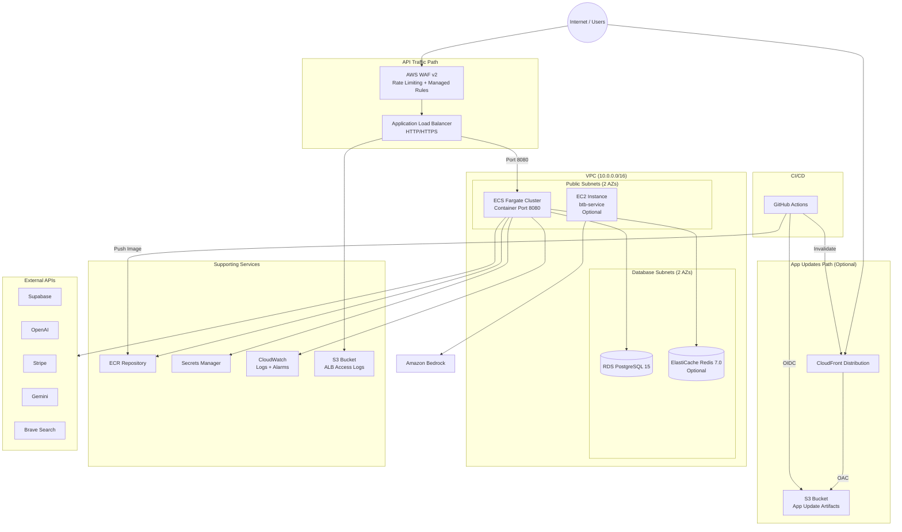
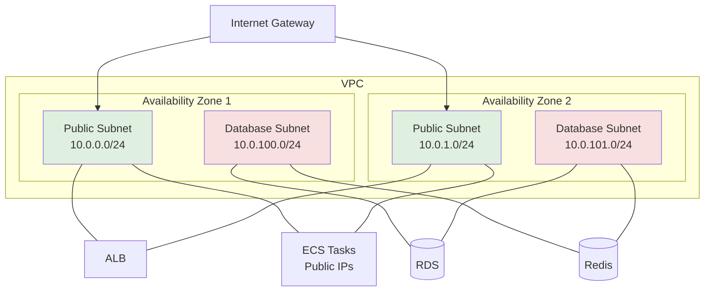
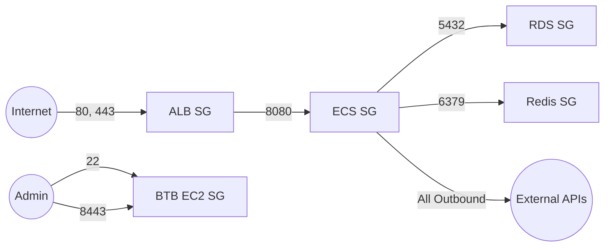
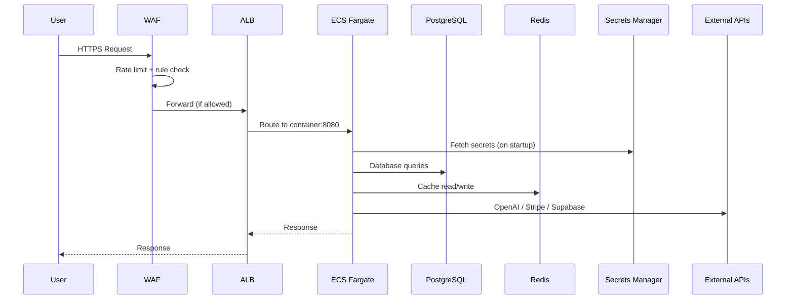
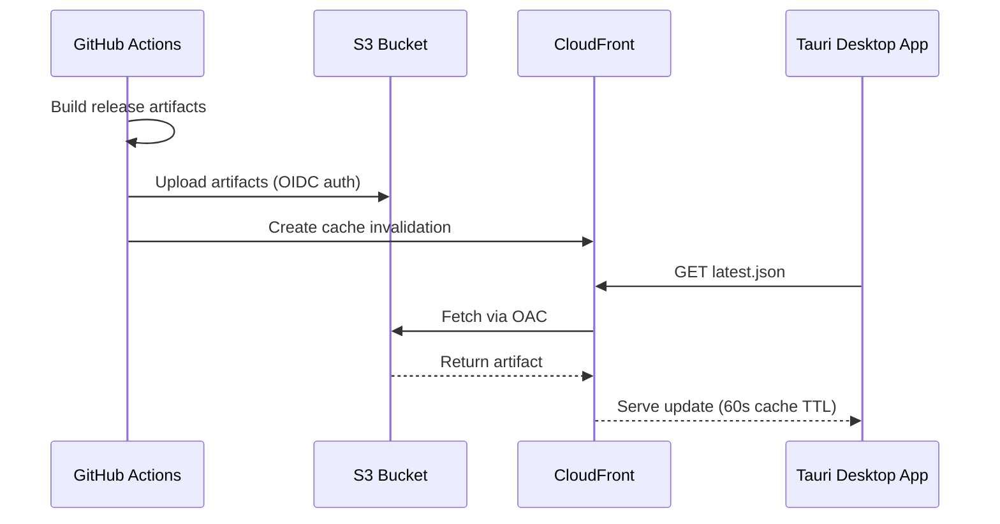
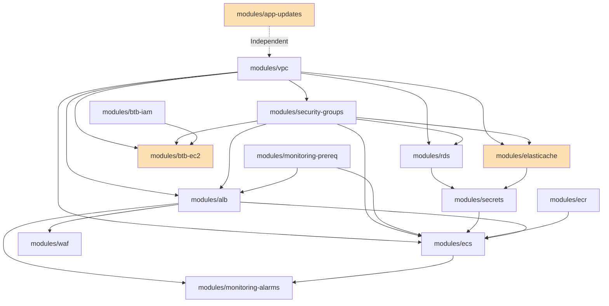

# Architecture Overview

## High-Level Infrastructure

## Network Architecture

## Security Groups

## Data Flow

## App Updates Flow

## Module Dependency Graph

> Orange modules are optional (controlled by feature flags).
